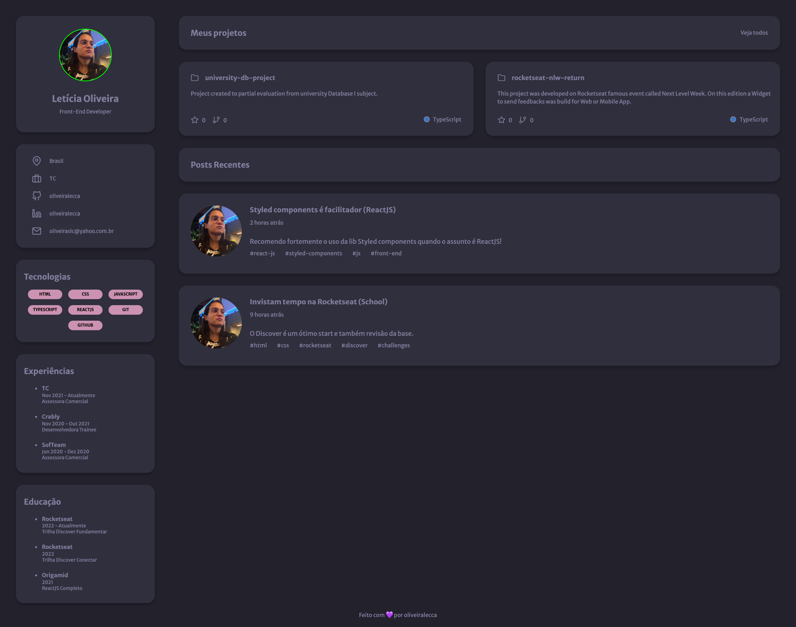

<div align="center" id="top"> 
  

  <!-- <a href="https://rocketseatdiscoverchallengeportfolio.netlify.app">Demo</a> -->
</div>

<h1 align="center">Rocketseat Discover Challenge Portfolio</h1>

<p align="center">
  

  

  

  <!--  -->

  <!--  -->

  <!--  -->

  <!--  -->
</p>

<!-- Status -->

<!-- <h4 align="center"> 
	🚧  Rocketseat Discover Challenge Portfolio 🚀 Under construction...  🚧
</h4> 

<hr> -->

<p align="center">
  <a href="#dart-about">About</a> &#xa0; | &#xa0; 
  <a href="#sparkles-features">Features</a> &#xa0; | &#xa0;
  <a href="#rocket-technologies">Technologies</a> &#xa0; | &#xa0;
  <a href="#white_check_mark-requirements">Requirements</a> &#xa0; | &#xa0;
  <a href="#checkered_flag-starting">Starting</a> &#xa0; | &#xa0;
  <!-- <a href="#memo-license">License</a> &#xa0; | &#xa0; -->
  <a href="https://github.com/oliveiralecca" target="_blank">Author</a>
</p>

<br>



## :dart: About ##

This project was developed as a challenge from the Rocketseat Discover trail. My goal with this project and course was to reinforce my programming basis.

The "Portfolio" project implements a simple page with a user's resume.

## :sparkles: Features ##

:heavy_check_mark: Professional information;\
:heavy_check_mark: Technologies;\
:heavy_check_mark: Experiences;\
:heavy_check_mark: Education;\
:heavy_check_mark: Projects developed;\
:heavy_check_mark: Posts

## :rocket: Technologies ##

The following tools were used in this project:

- HTML
- CSS

## :white_check_mark: Requirements ##

Before starting :checkered_flag:, I recommend you have [Live Server](https://marketplace.visualstudio.com/items?itemName=ritwickdey.LiveServer) extension installed.

## :checkered_flag: Starting ##

```bash
# Clone this project
$ git clone https://github.com/oliveiralecca/rocketseat-discover-challenge-portfolio

# Access
$ cd rocketseat-discover-challenge-portfolio

# Run the project
open `index.html` file or run `Live Server` on your VSCode with project open

# The page will initialize in the <http://127.0.0.1:5500/index.html>
```

<!-- ## :memo: License ##

This project is under license from MIT. For more details, see the [LICENSE](LICENSE.md) file. -->


Made with 💕 by <a href="https://github.com/oliveiralecca" target="_blank">Letícia Oliveira</a>

&#xa0;

<a href="#top">Back to top :top:</a>
